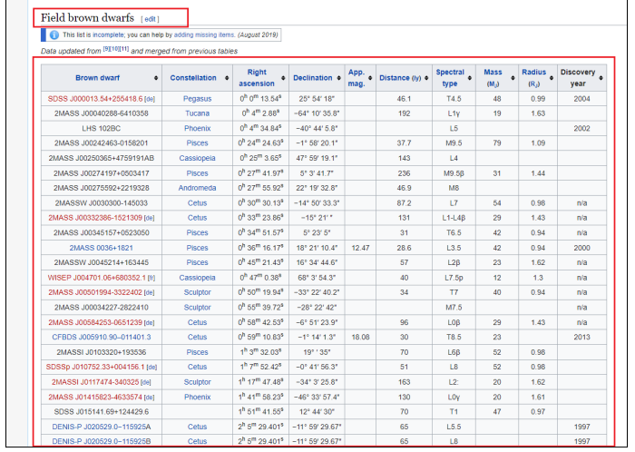
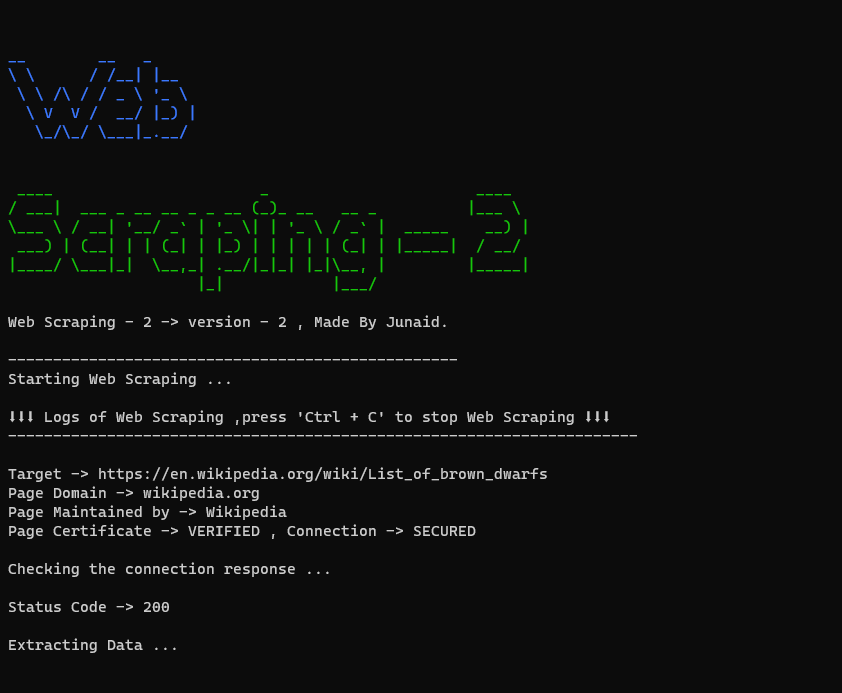
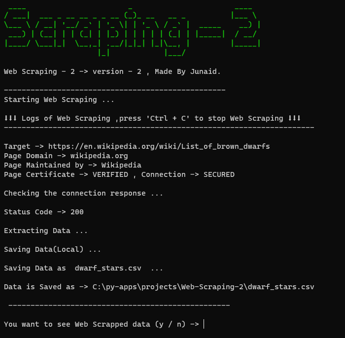
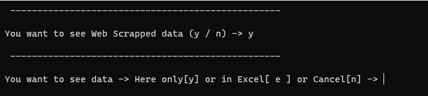
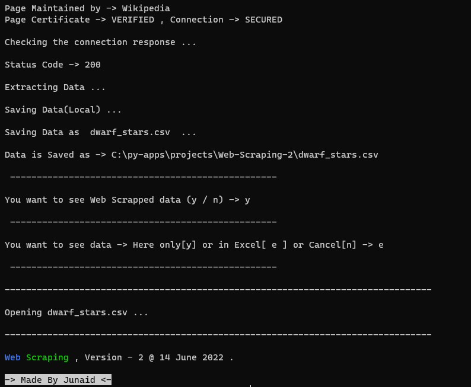
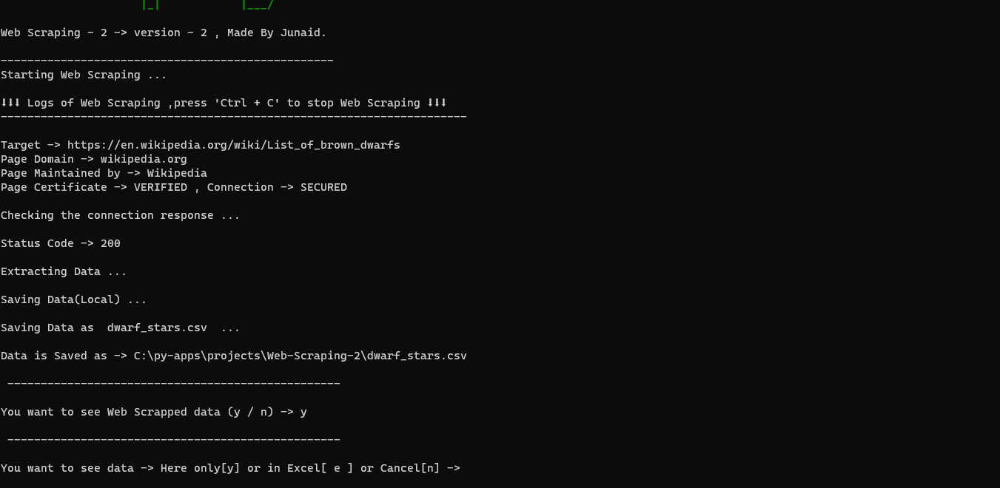
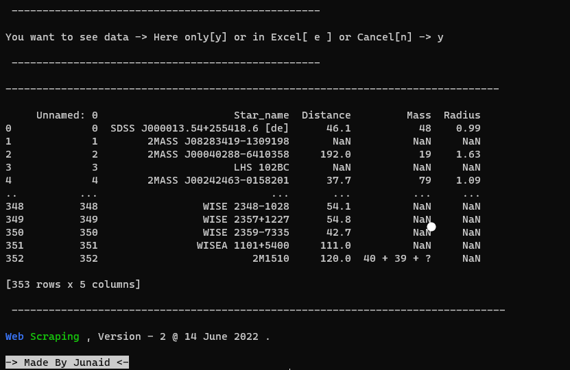

# Web Scraping 2

Web Scraping 2 , The latest version of Web Scraping ,This will scrape web and get the result what you need , In simples works it will hack that website or webpage and get the results what you need. Here I hacked Wikipedia to get the table which contains data. ! This is for learning purpose only - don't copy paste any data on website to your website. Made By [Junaid](https://abujuni.dev).

- Data (as webpage)-> [https://en.wikipedia.org/wiki/List_of_brown_dwarfs](https://en.wikipedia.org/wiki/List_of_brown_dwarfs#Field_brown_dwarfs)
  
  This table contains `<table>` ,`<tr>` and `<tl>` tags , which this Web Scraping finds and copy that text and using the help of for loop it take into one array and uses python data science tool `pandas` and web page testing tool `bs4`.

- This Version have some different features :

1. [Changed UI](#changed-ui) .
2. [Less Space consumption](#less-space-consumption) .
3. [Open Scraped data at Microsoft Excel app](#open-scraped-data-at-microsoft-excel-app) .

## Changed UI

Step to Step information .

## Less Space consumption

Now , this app consumes less space.

- `app.py -> 2KB`
- `webScraper.py -> 3KB`

$ 2kb + 3kb = 5kb $

- with installation stuff
- - README.md
- - requirements.txt
- - img
- `README.md -> 2KB`
- `requirements.txt -> 1KB`
- `img - (full folder) -> 7 Images -> 318KB + 1 gif = 1,208KB`

$2kb + 1kb + 1,208kb = 1,211kb $

$$
before = 5kb + 1,211kb = 121kb\\
before = 1216kb
$$

Now ,

- Removed all non - more style module `-1kb`.
- Used same modules to style a new UI `-2kb`.
- Used same modules open file in **Microsoft Excel app** `-1kb`.

$after  = 1kb + 2kb + 1kb = 4kb$

$$
Total = before - after\\
Total = 1216kb - 4kb = 1212kb
$$

Sorry ! , I can't reduce more !

## Open Scraped data at Microsoft Excel app

It asks `You want to see Web Scrapped data (y / n) ->` , say yes as `y` or you want to see yourself on File Explorer then say as `n` to cancel request.

Then it asks `You want to see data -> Here only[y] or in Excel[ e ] or Cancel[n] ->` , say `e` to open file in **Microsoft Excel app** .

### demo :

or say `y` to See data here only ,

or you want to see yourself on File Explorer then say as `n` to cancel request .
